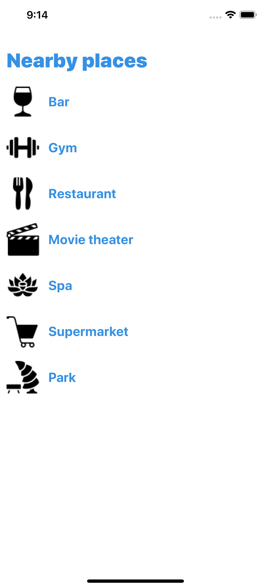

# OVIvonHIER
## Ort von Interesse <OVI = POI> von Hier

Just a really simple React Native app (my first one)

In order to see the app working

```sh
yarn install
```

then

```sh
yarn ios
```

TODO

- [x] Organize the structure
- [x] Load a list with icons
- [x] Apply some syle to the list
- [x] Get clicked item from the list
- [x] Redux - Integrate
- [x] Redux - Load categories list
- [ ] Redux - Load selected category list category
- [ ] Add navigation


