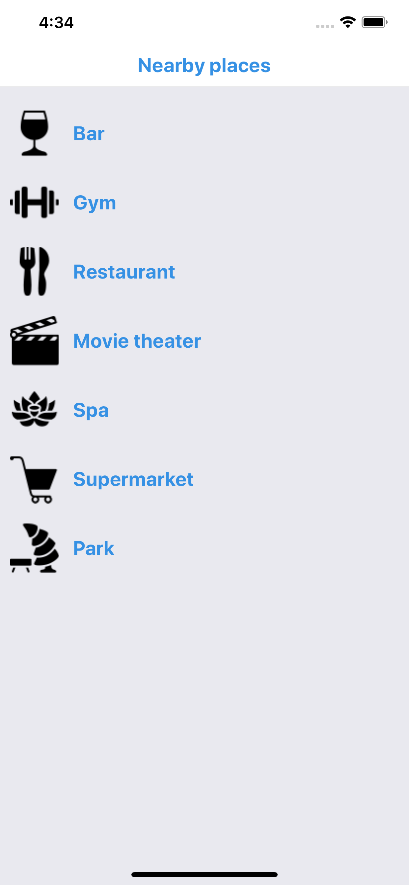
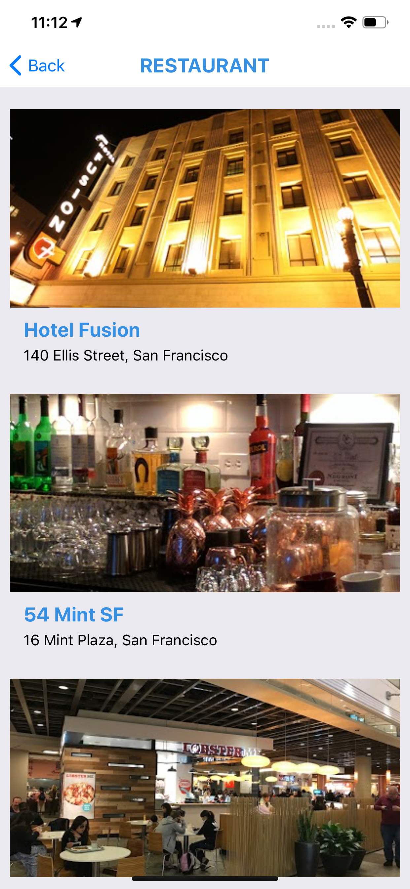

# OVIvonHIER
## Ort von Interesse <OVI = POI> von Hier

Just a really simple React Native app (my first one)
for a technical test

The basis:
- Static category list (bar, restaurant, gym)
- Call Google Places Nearby API for selected category using current user Location coordinates

note: a Google Places API key is needed

```sh
yarn install
```

then

```sh
yarn ios
```

TODO

- [x] Organize the structure
- [x] Load a list with icons
- [x] Apply some syle to the list
- [x] Get clicked item from the list
- [x] Redux - Integrate
- [x] Redux - Load categories list
- [x] Redux - Load selected category list category
- [x] Add navigation
- [x] Get current user location
- [x] Fetch data from some API
- [ ] Unit test
- [ ] Improve folder structure
- [ ] Follow existing convention




